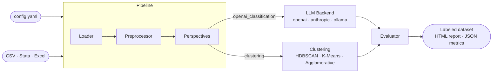
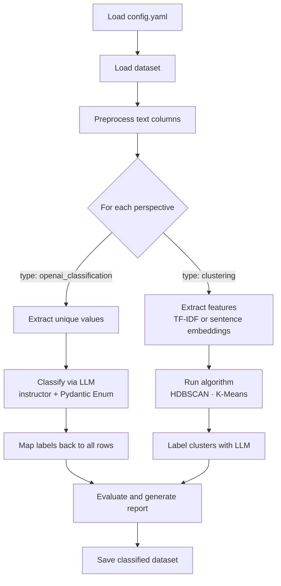
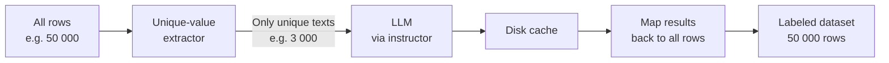
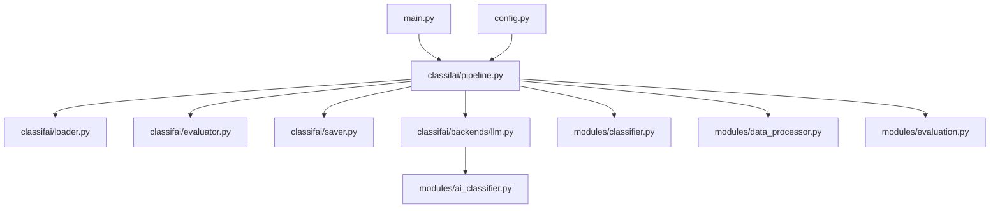
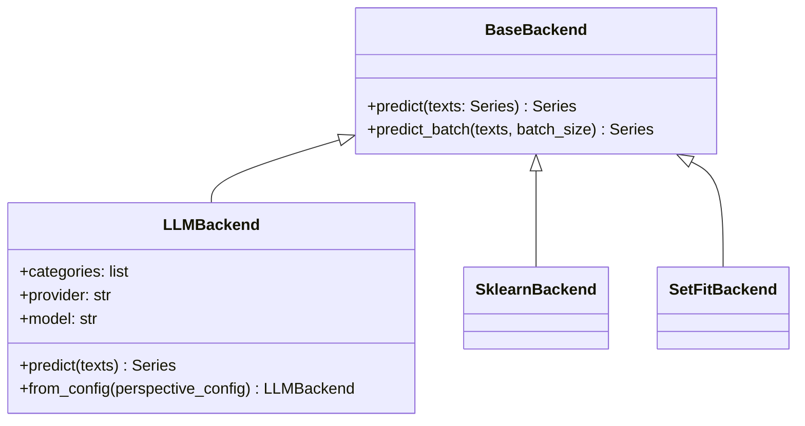

# Architecture

## Overview

classifai is a pipeline with two interchangeable classification modes that can run in the same job.

## Pipeline steps

## LLM backend: unique-value optimization

The key cost-saving mechanism — only distinct text values are sent to the model.

**Impact:** 90%+ reduction in API calls on real datasets where rows repeat.

## Package structure

## Adding a new backend

Every backend implements `BaseBackend` from `classifai/backends/base.py`:

To add a backend: create `classifai/backends/my_backend.py`, inherit `BaseBackend`, implement `predict()`, register in `classifai/backends/__init__.py`. See [CONTRIBUTING.md](../CONTRIBUTING.md).
