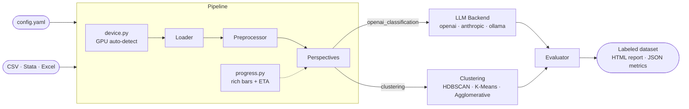
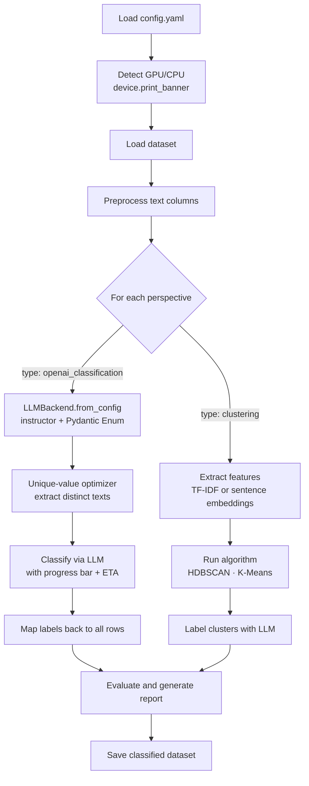
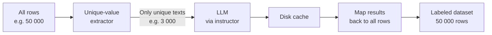
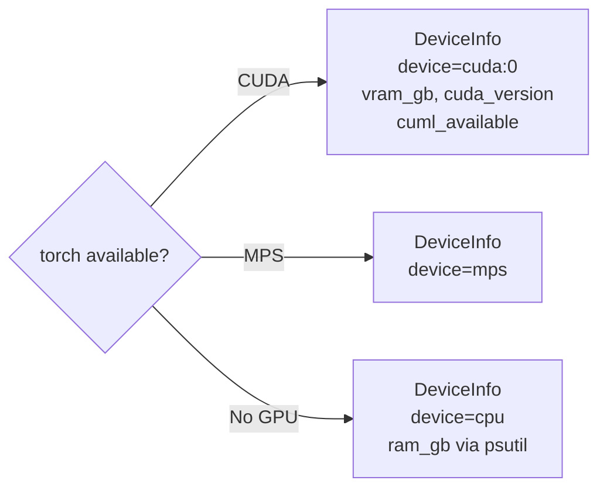
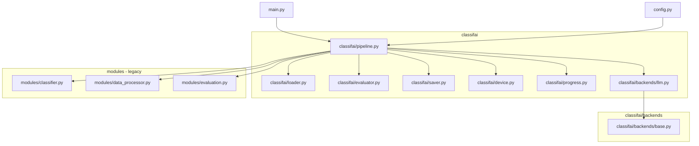
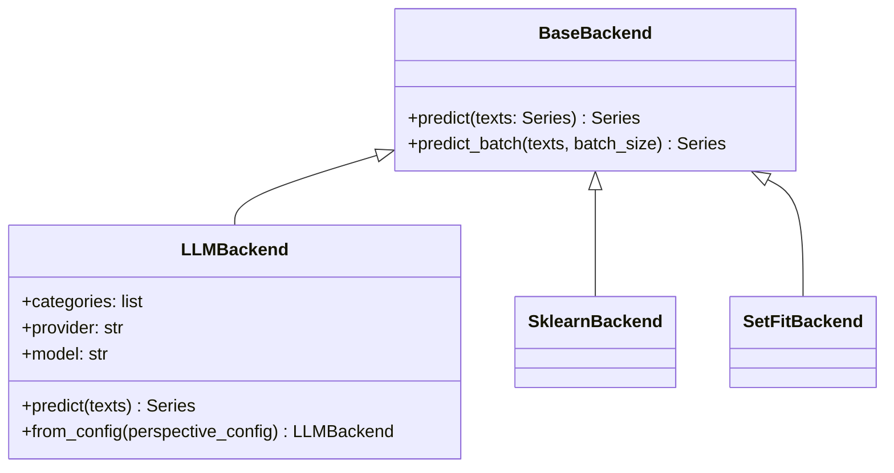

# Architecture

## Overview

classifai is a pipeline with two interchangeable classification modes that can run in the same job.



## Pipeline steps



## LLM backend: unique-value optimization

The key cost-saving mechanism — only distinct text values are sent to the model.



**Impact:** 90%+ reduction in API calls on real datasets where rows repeat.

## GPU auto-detection (`classifai/device.py`)

At startup the pipeline detects and logs the best available device — no manual configuration needed.

```
Priority: CUDA (NVIDIA) > MPS (Apple Silicon) > CPU
```



If [cuML (RAPIDS)](https://docs.rapids.ai/install) is installed, UMAP and HDBSCAN also run on the GPU.

```python
from classifai import device

info = device.get()          # DeviceInfo singleton
print(info.device)           # "cuda:0", "mps", or "cpu"
print(info.has_gpu)          # True / False
device.print_banner()        # rich Panel shown at startup
```

## Progress bars (`classifai/progress.py`)

`PipelineProgress` wraps `rich.progress` and is used throughout the pipeline for embedding, classification, and clustering steps.

```python
from classifai.progress import PipelineProgress

prog = PipelineProgress()

with prog.task("Classifying", total=n_unique) as advance:
    for batch in batches:
        classify(batch)
        advance(len(batch))

prog.update_cost(0.0012)     # accumulate LLM cost per call
prog.print_cost_summary()    # prints total calls + $ estimate
```

Falls back to plain `print` when `rich` is not installed or `quiet=True`.

## Package structure



The `modules/` directory is legacy code used for the `clustering` perspective. The `openai_classification` perspective now routes through `classifai/backends/llm.py` directly.

## Adding a new backend

Every backend implements `BaseBackend` from `classifai/backends/base.py`:



To add a backend: create `classifai/backends/my_backend.py`, inherit `BaseBackend`, implement `predict()`, register in `classifai/backends/__init__.py`. See [CONTRIBUTING.md](../CONTRIBUTING.md).
