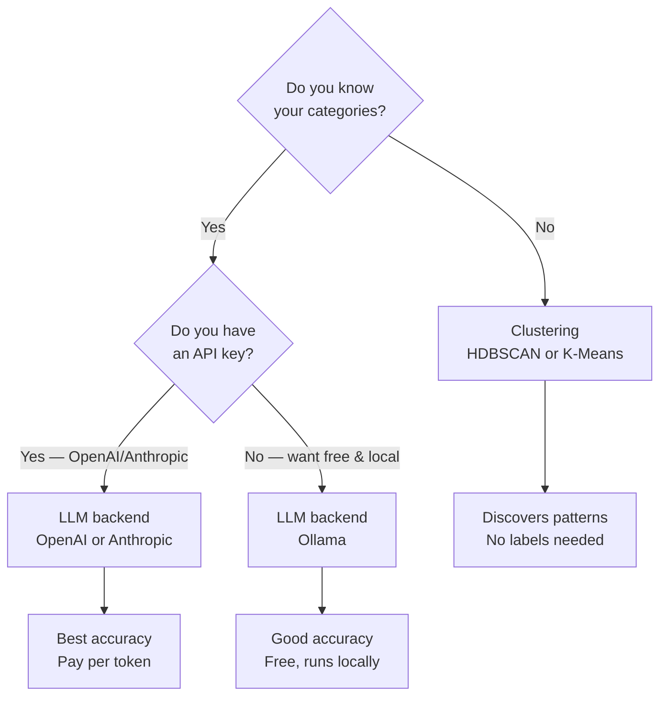
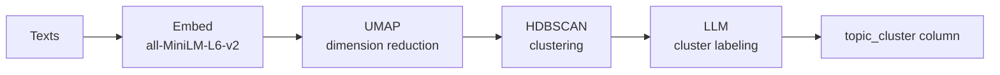

# Backends

## Choosing a backend



---

## LLM backend (`type: openai_classification`)

Uses [instructor](https://python.useinstructor.com/) to guarantee the model always returns one of your categories — no regex, no free-text parsing, no silent errors.

### OpenAI

```yaml
llm_config:
  provider: "openai"
  model: "gpt-4o-mini"        # recommended: fast and cheap
  temperature: 0.0
  api_key_env: "OPENAI_API_KEY"
```

**Model guide:**

| Model | Speed | Cost | Accuracy |
|---|---|---|---|
| `gpt-4o-mini` | Fast | Low | Very good |
| `gpt-4o` | Medium | High | Best |
| `gpt-3.5-turbo` | Fast | Low | Good |

### Anthropic

```yaml
llm_config:
  provider: "anthropic"
  model: "claude-haiku-4-5-20251001"
  temperature: 0.0
  api_key_env: "ANTHROPIC_API_KEY"
```

### Ollama (free, local)

Run any open-weight model on your machine — no API key, no cost, no data leaving your infrastructure.

```bash
# Install Ollama: https://ollama.com
ollama pull llama3      # or mistral, phi4, gemma3, qwen2.5, ...
ollama serve            # starts local server on :11434
```

```yaml
llm_config:
  provider: "ollama"
  model: "llama3"
  temperature: 0.0
```

**Local model guide:**

| Model | Size | Best for |
|---|---|---|
| `llama3` (8B) | 5 GB | General classification |
| `mistral` (7B) | 4 GB | Fast, good accuracy |
| `phi4` (14B) | 9 GB | Higher accuracy, needs more RAM |
| `gemma3` (9B) | 6 GB | Multilingual |
| `qwen2.5` (7B) | 4 GB | Multilingual, Asian languages |

### Python API

```python
from classifai.backends import LLMBackend

clf = LLMBackend(
    categories=["Billing", "Technical Support", "Account", "Other"],
    model="gpt-4o-mini",
    provider="openai",          # or "anthropic", "ollama"
    temperature=0.0,
)

labels = clf.predict(df["ticket_text"])
```

Build from an existing config block:

```python
clf = LLMBackend.from_config(perspective_config, global_config)
```

---

## Clustering (`type: clustering`)

No labels needed. classifai embeds your text, groups similar items, and uses an LLM to name each cluster.

### HDBSCAN — recommended for exploration

Finds the number of clusters automatically. Marks low-density points as noise (`-1`).

```yaml
type: "clustering"
algorithm: "hdbscan"
params:
  min_cluster_size: 20     # minimum items to form a cluster
  min_samples: 5           # controls noise sensitivity
```



### K-Means — when you know the number

```yaml
type: "clustering"
algorithm: "kmeans"
params:
  n_clusters: 8
  random_state: 42
```

### Feature extraction

What the text is converted to before clustering:

```yaml
feature_extraction:
  method: "hybrid"          # best default: TF-IDF + embeddings
  embedding:
    sentence_transformers:
      model_name: "all-MiniLM-L6-v2"   # 80 MB, fast, multilingual
      # alternatives:
      # "paraphrase-multilingual-MiniLM-L12-v2"  — stronger multilingual
      # "all-mpnet-base-v2"                       — higher accuracy, slower
```

---

## Running both in one job

```yaml
clustering_perspectives:

  department:               # AI: label with known categories
    type: "openai_classification"
    columns: [subject, body]
    target_categories: [Billing, Technical, Account, Other]
    output_column: "department"
    llm_config:
      provider: "openai"
      model: "gpt-4o-mini"
      api_key_env: "OPENAI_API_KEY"

  topics:                   # Clustering: discover unknown patterns
    type: "clustering"
    algorithm: "hdbscan"
    columns: [body]
    output_column: "topic_cluster"
```

The HTML report will include both results and a cross-perspective comparison.
