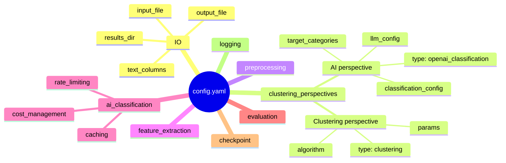

# Configuration reference

All behavior is controlled by a single YAML file passed with `--config`.
A fully annotated example is in [`config.example.yaml`](../config.example.yaml).

## Structure



## Required fields

```yaml
input_file:   "data/tickets.csv"     # CSV, Stata (.dta), or Excel (.xlsx)
output_file:  "data/classified.csv"
text_columns: [subject, body]        # columns to read and classify
results_dir:  "output"               # where HTML reports and JSON go

clustering_perspectives:
  my_classifier:                     # any name you choose
    type: "openai_classification"    # or "clustering"
    # ... see perspective types below
```

## Perspective types

### AI classification

```yaml
my_perspective:
  type: "openai_classification"
  columns: [subject, body]           # columns to combine as input
  target_categories:
    - Billing & Payments
    - Technical Support
    - Other
  output_column: "department"        # new column added to the dataset

  llm_config:
    provider: "openai"               # openai | anthropic | ollama
    model: "gpt-4o-mini"
    temperature: 0.0                 # 0.0 = deterministic
    max_tokens: 20
    api_key_env: "OPENAI_API_KEY"    # name of the env variable

  classification_config:
    batch_size: 50
    unknown_category: "Other"        # label for empty or ambiguous texts
    prompt_template: |               # optional — {text} and {categories} are injected
      Classify the support ticket below.
      Categories: {categories}
      Ticket: {text}
      Label only:
```

### Clustering

```yaml
my_perspective:
  type: "clustering"
  algorithm: "hdbscan"               # hdbscan | kmeans | agglomerative
  columns: [body]
  output_column: "topic_cluster"

  params:                            # algorithm-specific
    # HDBSCAN
    min_cluster_size: 20
    min_samples: 5

    # K-Means
    # n_clusters: 8
    # random_state: 42

    # Agglomerative
    # n_clusters: 10
    # linkage: "ward"
```

**Algorithm guide:**

| Algorithm | Use when |
|---|---|
| `hdbscan` | You don't know how many clusters exist; data has noise |
| `kmeans` | You want a fixed number of groups |
| `agglomerative` | You want a hierarchical view of the data |

## Preprocessing

```yaml
preprocessing:
  lowercase: true
  remove_punctuation: false   # keep ? ! for support tickets
  remove_stopwords: false     # disable for technical text
  lemmatize: false
  min_word_length: 2
  max_length: 2000            # truncate at N characters
```

## Feature extraction (clustering only)

```yaml
feature_extraction:
  method: "hybrid"            # tfidf | embedding | hybrid

  tfidf:
    max_features: 2000
    ngram_range: [1, 2]
    min_df: 2

  embedding:
    model: "sentence-transformers"
    sentence_transformers:
      model_name: "all-MiniLM-L6-v2"   # fast, good quality
```

## Cost control (AI backend)

```yaml
ai_classification:
  cost_management:
    max_cost_per_run: 5.00    # hard stop — job aborts if exceeded

  caching:
    enabled: true
    cache_directory: ".cache/classifai"

  rate_limiting:
    requests_per_minute: 500
    concurrent_requests: 5
```

Cost estimate with `gpt-4o-mini` and unique-value optimization:

| Dataset rows | Typical unique texts | Estimated cost |
|---|---|---|
| 10 000 | ~2 000 | ~$0.05 |
| 100 000 | ~15 000 | ~$0.40 |
| 1 000 000 | ~80 000 | ~$2.00 |

## Evaluation and reporting

```yaml
evaluation:
  metrics:
    - silhouette_score
    - davies_bouldin_score
  visualizations:
    - distribution_plot
    - embeddings_plot
  output_format:
    - html
    - json
```

## Checkpointing

```yaml
checkpoint:
  enabled: true               # resume interrupted runs
  directory: "checkpoints"
```

## CLI overrides

Any config value can be overridden at runtime:

```bash
python main.py --config config.yaml \
  --input data/new.csv \
  --output results/out.csv \
  --log-level debug \
  --force-recalculate        # ignore cache and checkpoints
```
